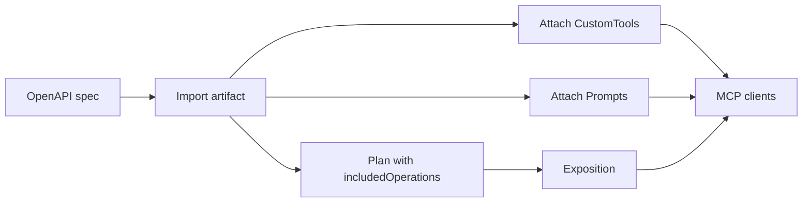

# MCP server setup — step-by-step (UI and CLI)

This guide walks through exposing an HTTP API as a **Reshapr MCP server** with:

- a restricted set of API **operations** (`includedOperations`, CLI `--io`);
- optional **custom tools** (`kind: CustomTools`);
- optional **MCP prompts** (`kind: Prompts`).

The UI path uses **Artifacts**, **Plans**, and verification pages **MCP custom tools** / **MCP prompts**. CLI commands are the same contracts (`reshapr import`, `reshapr config create`, `reshapr attach`).

**Prerequisites**

- Control plane running and UI signed in (on-prem or SaaS).
- OpenAPI (or GraphQL) specification for the backend API.
- Backend base URL (e.g. `https://api.example.com/v1`).
- Optional: gateway group ID (default `1`).

---

## Overview

| Step | Goal | UI | CLI (equivalent) |
|------|------|-----|------------------|
| 1 | Register the API spec as a **service** | Artifacts → **1. Import + expose** or import only | `reshapr import -f\|-u …` |
| 2 | **Plan** + **exposition** with `includedOperations` | Same form (`--io`) or Plans → New plan | `reshapr config create` + exposition APIs |
| 3 | Attach **custom tools** | Artifacts → **3. Attach custom tools** | `reshapr attach -f custom-tools.yaml` |
| 4 | Attach **prompts** | Artifacts → **4. Attach MCP prompts** | `reshapr attach -f prompts.yaml` |
| 5 | Verify | MCP custom tools / MCP prompts | MCP client or UI lists |

Steps 1 and 2 can be done in **one UI action** (*Import + expose*) or **split** (import only, then create the plan on **Plans**).

---

## Step 1 — Import the API specification

The control plane stores the spec as the main artifact and creates a **service** (name + version from the spec).

### Option A — Import + expose (recommended)

**UI:** [Artifacts](/artifacts) → section **1. Import + expose**.

1. Choose **file** or **URL** for the OpenAPI (or GraphQL) spec.
2. Set **Backend endpoint** (`--backendEndpoint`) — base URL Reshapr calls for proxied operations.
3. Set **Gateway group ID** (often `1`).
4. Optionally set **Backend secret ID** if the backend requires a stored secret.
5. For GraphQL only: fill **serviceName** and **serviceVersion** together, or leave both empty.
6. Submit **Import and expose**.

This runs: `POST /api/v1/artifacts` → create configuration plan → create exposition.

Note the success message: **service id**, **plan id**, **exposition id**. Copy the **API key** if you enabled key generation.

### Option B — Import only (split workflow)

**UI:** Artifacts → **2. Import specification only** (file or URL).

Then continue with step 2 on **Plans → New plan** using the **service id** from **Services**.

**CLI:**

```bash
reshapr import -f ./openapi.yaml
# or
reshapr import -u https://example.com/openapi.json
```

---

## Step 2 — Restrict operations (`includedOperations` / `--io`)

A **configuration plan** binds the service to a backend URL and defines which OpenAPI operations are exposed on MCP.

### Included operations format

One operation per line, or a JSON array (same as CLI `--io`):

```text
POST /tests/{testId}/start
GET /masters
```

```json
["POST /tests/{testId}/start", "GET /masters"]
```

Leave empty to expose all operations allowed by the service (custom tools may still filter further).

### Option A — Already done in step 1

In **Import + expose**, fill **Included operations** before submit.

### Option B — Plan after import only

**UI:** [Plans → New plan](/plans/new)

- **Service ID** — from **Services**
- **Backend endpoint URL**
- **Included operations** / **Excluded operations** (`--eo`, only when included is empty)
- Create, then create an **exposition** on [Expositions](/expositions) if not already done.

**CLI (BlazeMeter-style example):**

```bash
reshapr config create 'my-api-operations' \
  --serviceId '<SERVICE_ID>' \
  --backendEndpoint 'https://a.blazemeter.com/api/v4' \
  --io '["POST /tests/{testId}/start", "GET /masters"]'
```

Edit an existing plan: **Plans → detail** → **Operations filter** or full JSON (PUT).

---

## Step 3 — Attach custom tools

Custom tools are defined in YAML (`kind: CustomTools`) and attached to the **same service** as the OpenAPI import.

**UI:** Artifacts → **3. Attach custom tools (YAML)** — file or URL.

**CLI:**

```bash
reshapr attach -f ./custom-tools.yaml
```

### YAML requirements

- `apiVersion: reshapr.io/v1alpha1`
- `kind: CustomTools`
- `service.name` and `service.version` must **match** the imported service exactly.
- `customTools:` map — each entry can reference an OpenAPI operation via `tool: <operationId>`.

Example (from [reshapr `dev/github-api-custom-tools.yaml`](https://github.com/reshaprio/reshapr/blob/main/dev/github-api-custom-tools.yaml)):

```yaml
apiVersion: reshapr.io/v1alpha1
kind: CustomTools
service:
  name: GitHub GraphQL
  version: '20250917'
customTools:
  get_user_with_latest_followers:
    tool: user
    description: Get a user details with the latest followers details
    input:
      type: object
      properties:
        user:
          type: string
      required:
        - user
```

**Verify:** [MCP custom tools](/mcp-custom-tools) — paste the MCP URL from **List MCP URLs**, then resolve tools (reads `RESHAPR_CUSTOM_TOOLS` via the control plane, no browser CORS to the gateway).

---

## Step 4 — Attach MCP prompts

Prompts use the same attach API with `kind: Prompts`.

**UI:** Artifacts → **4. Attach MCP prompts (YAML)**.

**CLI:**

```bash
reshapr attach -f ./prompts.yaml
```

### YAML requirements

- `apiVersion: reshapr.io/v1alpha1`
- `kind: Prompts`
- `service.name` / `service.version` matching the service.
- `prompts:` map — each key is the prompt name exposed on MCP.

Example (from [reshapr `dev/apipastry-prompts.yaml`](https://github.com/reshaprio/reshapr/blob/main/dev/apipastry-prompts.yaml)):

```yaml
apiVersion: reshapr.io/v1alpha1
kind: Prompts
service:
  name: API Pastry - 2.0
  version: 2.0.0
prompts:
  list_pastries:
    title: List the pastries
    description: Browse the catalog
    result: Get all the pastries from the catalog
  get_pastry:
    title: Get details of a pastry
    arguments:
      - name: name
        description: Pastry name
        required: true
    result: Get details for pastry '${name}'
```

**Verify:** [MCP prompts](/mcp-prompts) — same MCP URL; listing uses artifact `RESHAPR_PROMPTS` on the control plane.

---

## Step 5 — Verify the MCP endpoint

1. **Expositions** — confirm an active exposition for your plan and gateway.
2. **MCP custom tools** / **MCP prompts** — **List MCP URLs**, pick your exposition, run **List**.
3. Connect an MCP client (Cursor, Claude Desktop, etc.) to the MCP URL shown.

MCP URL shape:

```text
https://<gateway-host>/mcp/<organizationId>/<serviceName>/<serviceVersion>
```

### Troubleshooting

| Symptom | Likely cause |
|---------|----------------|
| `Failed to fetch` on old prompts page | Browser called the MCP gateway directly (CORS). Use current UI (control-plane artifact resolution). |
| No `RESHAPR_PROMPTS` artifact | Attach failed or wrong service name/version in YAML. |
| Custom tools empty | No `RESHAPR_CUSTOM_TOOLS` artifact, or `tool:` ids not in `includedOperations`. |
| Service not found from MCP URL | Path segments do not match **Services** name/version/org. |
| Attach OK but MCP empty | Exposition not active, or plan does not include the operations your tools reference. |

---

## Split vs combined workflow (summary)



**Combined:** Artifacts **Import + expose** (+ optional `--io` in the same form) → attach tools → attach prompts → verify.

**Split:** Import only → Plans (operations) → Expositions → attach tools → attach prompts → verify.

---

## Related documentation

- [ARCHITECTURE.md](./ARCHITECTURE.md) — auth, env vars, MCP scope in the UI.
- [PRODUCTION_DEPLOYMENT.md](./PRODUCTION_DEPLOYMENT.md) — CORS and reverse proxy for the SPA.
- [plans/api_cli_et_ui_web.md](./plans/api_cli_et_ui_web.md) — REST route map (CLI-aligned).
