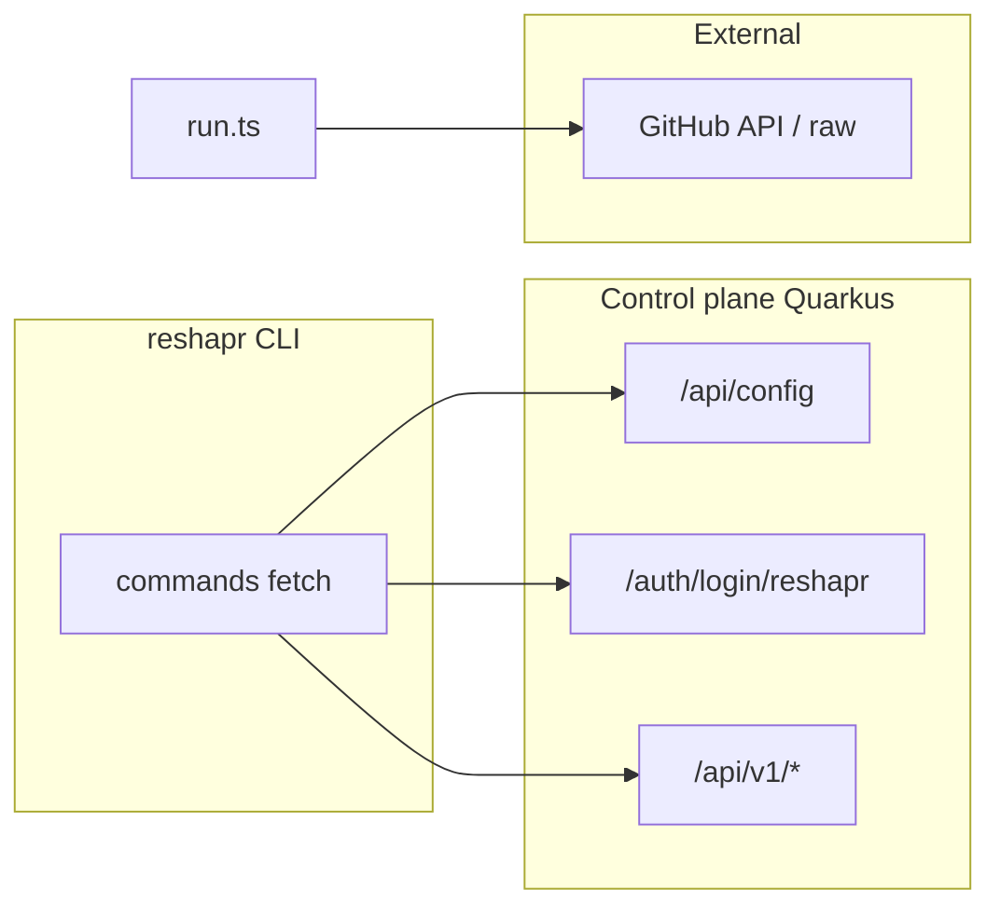

<!-- Archive of Cursor plan `api_cli_et_ui_web_786aed26.plan.md` (body matches the approved plan). -->

# APIs consumed by the CLI and feasibility of a web UI

## CLI network scope

- **Base URL**: `cli/src/utils/config.ts` in the reshapr repo — `server` field (e.g. default `https://try.reshapr.io` at login).
- **Authentication**: generally `Authorization: Bearer <token>` on `/api/v1/*`, except bootstrap and login.

## Endpoints called by the CLI (control plane)

| Area | Methods / paths (relative to `server`) | CLI files (reshapr) |
|------|------------------------------------------|---------------------|
| Bootstrap | `GET /api/config` | `cli/src/commands/login.ts`, `cli/src/commands/info.ts` |
| On-prem auth | `POST /auth/login/reshapr` (JSON username/password body; response body = token) | `cli/src/commands/login.ts` — server: `control-plane/.../AuthenticationController.java` |
| SaaS auth | OAuth: local HTTP server + callback with `token` and `ctrl_url` | `cli/src/commands/login.ts` |
| Artifacts | `POST /api/v1/artifacts`, `POST /api/v1/artifacts/attach` | `cli/src/commands/import.ts`, `cli/src/commands/attach.ts` |
| Plans | `GET/POST /api/v1/configurationPlans`, `GET/PUT/DELETE /api/v1/configurationPlans/{id}`, `POST .../renewApiKey` (CLI uses **PUT** for updates, not PATCH) | `cli/src/commands/import.ts`, `cli/src/commands/config.ts` |
| Expositions | `GET/POST /api/v1/expositions`, `GET/DELETE /api/v1/expositions/{id}`, `GET /api/v1/expositions/active`, `GET /api/v1/expositions/active/{id}` | `cli/src/commands/import.ts`, `cli/src/commands/expo.ts` |
| Services | `GET /api/v1/services`, `GET/DELETE /api/v1/services/{id}` | `cli/src/commands/service.ts`, `cli/src/commands/config.ts` |
| Secrets | `GET /api/v1/secrets/refs`, `GET/POST/PUT/DELETE /api/v1/secrets`, `.../secrets/{id}` (**PUT** updates on server) | `cli/src/commands/secret.ts` |
| Gateway groups | `GET/POST /api/v1/gatewayGroups`, `DELETE /api/v1/gatewayGroups/{id}` | `cli/src/commands/gateway-group.ts` |
| Tenant quotas | `GET /api/v1/quotas` | `cli/src/commands/quotas.ts` |
| API tokens | `POST/GET /api/v1/tokens/apiTokens`, `DELETE /api/v1/tokens/apiTokens/{tokenId}` | `cli/src/commands/api-token.ts` |

**Outside the control plane** (but HTTP):

- `cli/src/commands/run.ts`: GitHub API + raw.githubusercontent.com for compose.
- **E2E only** `cli/e2e/helpers/setup.ts`: `/api/admin/*` (admin).

**No HTTP calls to the control plane**: `stop`, `status` (local Docker Compose).

## Mapping on the control plane side

JAX-RS resources under `control-plane/src/main/java/io/reshapr/ctrl/rest/` — e.g. `ArtifactResource` `@Path("/api/v1/artifacts")`, `AppConfigurationResource` `@Path("/api/config")`. `control-plane/pom.xml` is API-oriented (Quarkus REST, gRPC).

## Web UI feasibility

**Yes, without new business backend**: same JSON surface as the CLI.

**Watch points**:

1. **Auth**: on-prem → token; SaaS → OAuth (align with CLI).
2. **CORS**: `quarkus.http.cors` + `RESHAPR_HTTP_CORS_ORIGINS` (see `docs/reshapr-control-plane-CORS.md` in this repo).
3. **Hosting**: Option A (embedded) vs Option B (separate SPA, e.g. micepe / reshapr-ui-control).
4. **CLI without API**: `reshapr run` stays CLI / ops.

## Recommended next step (historical)

Decide Option A vs B and session model (SPA Bearer vs BFF) — **already decided** for reshapr-ui-control: Option B + Bearer in `sessionStorage`, see `docs/ARCHITECTURE.md`.

## Diagram (network flow)

