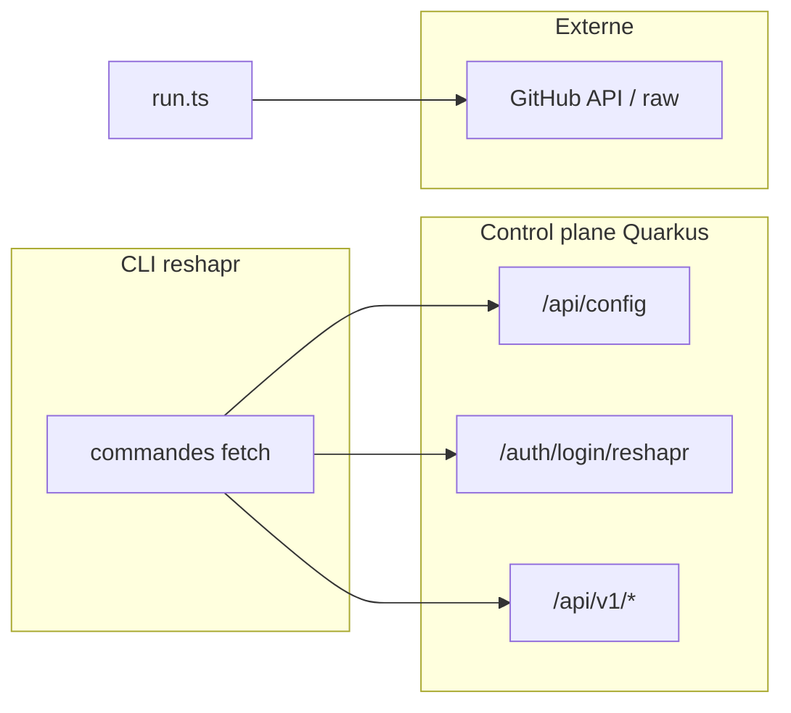

<!-- Archive du plan Cursor `api_cli_et_ui_web_786aed26.plan.md` (corps identique au plan validé). -->

# APIs consommées par le CLI et faisabilité d'une UI web

## Périmètre réseau du CLI

- **Base URL** : `cli/src/utils/config.ts` dans le dépôt reshapr — champ `server` (ex. `https://try.reshapr.io` par défaut au login).
- **Authentification** : en général `Authorization: Bearer <token>` sur les routes `/api/v1/*`, sauf bootstrap et login.

## Endpoints appelés par le CLI (control-plane)

| Zone | Méthodes / chemins (relatifs à `server`) | Fichiers CLI (reshapr) |
|------|------------------------------------------|-------------------------|
| Bootstrap | `GET /api/config` | `cli/src/commands/login.ts`, `cli/src/commands/info.ts` |
| Auth on-prem | `POST /auth/login/reshapr` (corps JSON username/password ; réponse texte = token) | `cli/src/commands/login.ts` — serveur : `control-plane/.../AuthenticationController.java` |
| Auth SaaS | OAuth : serveur HTTP local + callback avec `token` et `ctrl_url` | `cli/src/commands/login.ts` |
| Artifacts | `POST /api/v1/artifacts`, `POST /api/v1/artifacts/attach` | `cli/src/commands/import.ts`, `cli/src/commands/attach.ts` |
| Plans | `GET/POST /api/v1/configurationPlans`, `GET/PUT/DELETE /api/v1/configurationPlans/{id}`, `POST .../renewApiKey` (le CLI utilise **PUT** pour mise à jour, pas PATCH) | `cli/src/commands/import.ts`, `cli/src/commands/config.ts` |
| Expositions | `GET/POST /api/v1/expositions`, `GET/DELETE /api/v1/expositions/{id}`, `GET /api/v1/expositions/active`, `GET /api/v1/expositions/active/{id}` | `cli/src/commands/import.ts`, `cli/src/commands/expo.ts` |
| Services | `GET /api/v1/services`, `GET/DELETE /api/v1/services/{id}` | `cli/src/commands/service.ts`, `cli/src/commands/config.ts` |
| Secrets | `GET /api/v1/secrets/refs`, `GET/POST/PUT/DELETE /api/v1/secrets`, `.../secrets/{id}` (mise à jour **PUT** côté serveur) | `cli/src/commands/secret.ts` |
| Gateway groups | `GET/POST /api/v1/gatewayGroups`, `DELETE /api/v1/gatewayGroups/{id}` | `cli/src/commands/gateway-group.ts` |
| Quotas (tenant) | `GET /api/v1/quotas` | `cli/src/commands/quotas.ts` |
| API tokens | `POST/GET /api/v1/tokens/apiTokens`, `DELETE /api/v1/tokens/apiTokens/{tokenId}` | `cli/src/commands/api-token.ts` |

**Hors control-plane** (mais HTTP) :

- `cli/src/commands/run.ts` : GitHub API + raw.githubusercontent.com pour compose.
- **E2E uniquement** `cli/e2e/helpers/setup.ts` : `/api/admin/*` (admin).

**Sans appel HTTP au control-plane** : `stop`, `status` (Docker Compose local).

## Correspondance côté control-plane

Ressources JAX-RS sous `control-plane/src/main/java/io/reshapr/ctrl/rest/` — ex. `ArtifactResource` `@Path("/api/v1/artifacts")`, `AppConfigurationResource` `@Path("/api/config")`. Le `control-plane/pom.xml` est orienté API (Quarkus REST, gRPC).

## Faisabilité d'une interface web

**Oui, sans nouveau backend métier** : même surface JSON que le CLI.

**Points d'attention** :

1. **Auth** : on-prem → token ; SaaS → OAuth (aligner avec le CLI).
2. **CORS** : `quarkus.http.cors` + `RESHAPR_HTTP_CORS_ORIGINS` (voir `docs/reshapr-control-plane-CORS.md` dans ce dépôt).
3. **Hébergement** : Option A (embarqué) vs Option B (SPA séparée, ex. micepe / reshapr-ui-control).
4. **CLI sans API** : `reshapr run` reste CLI / ops.

## Prochaine étape recommandée (historique)

Décider Option A vs B et modèle de session (Bearer SPA vs BFF) — **déjà tranché** pour reshapr-ui-control : Option B + Bearer `sessionStorage`, voir `docs/ARCHITECTURE.md`.

## Diagramme (flux réseau)

