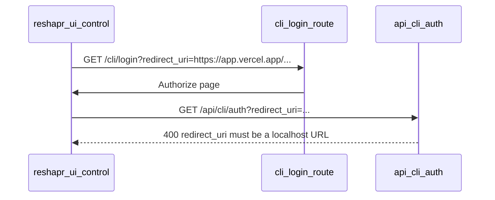

# Upstream issue draft — OAuth `redirect_uri` allowlist

Copy the sections below into GitHub issue(s). Adjust property names to match project conventions before submitting.

## Verified in code (2026-05)

Production **https://try.reshapr.io** is built from **[lbroudoux/try.reshapr.io](https://github.com/lbroudoux/try.reshapr.io)** (local clone: `GOZEN/TOOLS/try.reshapr.io`).

The error **`redirect_uri must be a localhost URL`** is returned by the **portal app**, not by `reshapr/control-plane`:

| Step | File (try.reshapr.io) |
|------|------------------------|
| `GET /cli/login?redirect_uri=…` | `src/routes/cli/login/+page.server.ts` — session gate, preserves `redirect_uri` |
| Authorize UI | `src/routes/cli/login/+page.svelte` — links to `/api/cli/auth?redirect_uri=…` |
| **Validation (400)** | `src/routes/api/cli/auth/+server.ts` — lines 26–34, `hostname` must be `localhost` or `127.0.0.1` |
| Token + redirect back | Same file — `generateTokenForUser`, redirect with `token` + `ctrl_url` (`RESHAPR_CTRL_PUBLIC_URL`) |

No match for that error string under `reshapr/control-plane` in this workspace. **Primary issue → lbroudoux/try.reshapr.io.** Optional linked issue on reshapr only for aligned self-hosted behavior.



---

## Which repository?

| Repository | When to open an issue |
|------------|------------------------|
| **[lbroudoux/try.reshapr.io](https://github.com/lbroudoux/try.reshapr.io)** | **Required** — Vercel / any non-localhost `redirect_uri` on try.reshapr.io |
| [reshaprio/reshapr](https://github.com/reshaprio/reshapr) | Optional — generic CP install config if `/cli/login` is ever exposed on self-hosted Quarkus |

**Recommended:** file on **try.reshapr.io** first; cross-link a reshapr issue only if product owners want parity in open-source CP.

---

# Issue A — lbroudoux/try.reshapr.io (primary)

Paste into: https://github.com/lbroudoux/try.reshapr.io/issues/new

## Title

**Allow configurable CLI / web UI `redirect_uri` callbacks (beyond localhost)**

Short alternative: `Feature: ALLOWED_CLI_REDIRECT_URIS for /api/cli/auth`

## Body

### Context

The SaaS portal at **https://try.reshapr.io** supports CLI sign-in via:

1. `GET /cli/login?redirect_uri=…` — authorization page
2. `GET /api/cli/auth?redirect_uri=…` — issues JWT and redirects back

The [reshapr CLI](https://github.com/reshaprio/reshapr) uses `redirect_uri=http://localhost:{port}` (see `cli/src/commands/login.ts`).

The **[reshapr-ui-control](https://github.com/reshaprio/reshapr-ui-control)** operator console reuses `/cli/login` for “Sign in with reShapr” from a browser (e.g. static hosting on Vercel).

### Current behavior

In `src/routes/api/cli/auth/+server.ts`, only `localhost` / `127.0.0.1` hostnames are accepted:

```typescript
if (parsedUri.hostname !== 'localhost' && parsedUri.hostname !== '127.0.0.1') {
  return new Response('redirect_uri must be a localhost URL', { status: 400 });
}
```

Deployed web UIs pass origins like `https://<project>.vercel.app` (or `https://console.example.com/login/callback`) and receive **400** before a token is issued.

This is **not** a CORS issue. CORS applies to API calls on `ctrl_url` after login; this check runs on the portal during CLI auth.

### Desired behavior

Add deploy-time configuration (Helm / env), e.g.:

| Setting (illustrative) | Example |
|------------------------|---------|
| `ALLOWED_CLI_REDIRECT_URIS` | `https://console.example.com/login/callback,https://console-staging.example.com/login/callback` |

Requirements:

- Comma-separated **exact** callback URLs (scheme + host + port + path).
- **Keep localhost allowed by default** so existing CLI flows unchanged.
- Validate in `src/routes/api/cli/auth/+server.ts` (and optionally early in `cli/login` load).
- Wire through `.env.example`, `chart/values.yaml`, `chart/templates/app-deployment.yaml` (same pattern as `RESHAPR_CTRL_PUBLIC_URL`).
- No open redirects: no uncontrolled wildcards.

### Suggested acceptance criteria

- [ ] Env / Helm value for additional allowed `redirect_uri` values.
- [ ] Localhost still works without extra config.
- [ ] HTTPS production callbacks work when listed.
- [ ] Invalid `redirect_uri` → 400 with generic message.
- [ ] README or chart docs: CLI vs web console, relation to CORS on tenant API.

### References

- Validator: `src/routes/api/cli/auth/+server.ts`
- Routes: `src/routes/cli/login/+page.server.ts`, `+page.svelte`
- Existing env: `RESHAPR_CTRL_PUBLIC_URL` in `.env.example`

---

# Issue B — reshaprio/reshapr (optional, linked)

Paste into: https://github.com/reshaprio/reshapr/issues/new

## Title

**Configurable OAuth `redirect_uri` allowlist for web UIs (control plane / install)**

## Body

### Context

CLI SaaS login uses the **portal** `/cli/login` flow (today implemented in [lbroudoux/try.reshapr.io](https://github.com/lbroudoux/try.reshapr.io), not in this repo’s `control-plane/`).

For **self-hosted** deployments that might expose the same contract, operators may need install-time config analogous to `RESHAPR_HTTP_CORS_ORIGINS`.

### Desired behavior (if applicable to open-source CP)

| Setting (illustrative) | Example |
|------------------------|---------|
| `RESHAPR_CLI_OAUTH_REDIRECT_URIS` | `https://console.example.com/login/callback` |

Document in `install/docker-compose*.yml` and `application.properties`.

### Link

Blocked production case for **try.reshapr.io**: see issue #___ on **lbroudoux/try.reshapr.io** (portal validator in `src/routes/api/cli/auth/+server.ts`).

---

## Notes for submitter (do not paste into GitHub)

- **reshapr-ui-control** uses `buildSaasLoginUrl()` → `{portal}/cli/login?redirect_uri=…` ([`src/lib/auth/saas.ts`](../src/lib/auth/saas.ts)).
- After portal allowlist: set `PUBLIC_RESHAPR_SAAS_REDIRECT_URI` at UI build time to the same URL.
- **CORS** on `ctrl_url` (tenant API) is still required post-login — separate from this issue.
- Reverse proxy on Vercel for `/api` only does **not** fix `/cli/login`.
- Prefer a **stable custom domain** on Vercel over per-preview `*.vercel.app` URLs.

### Related docs in this repo

- [PRODUCTION_DEPLOYMENT.md](./PRODUCTION_DEPLOYMENT.md)
- [ARCHITECTURE.md](./ARCHITECTURE.md)
